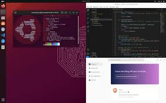

<html lang="es">
<head>
    <meta charset="UTF-8">
    <meta name="viewport" content="width=device-width, initial-scale=1.0">
    <title>Ubuntu - Sistemas Operativos</title>
    
</head>
<body>
    
Herramientas de Software y Sistemas Operativos

    
    <h1>Lista de Versiones de Ubuntu</h1>
    <table>
        <tr>
            <th>Versión</th>
            <th>Año de Lanzamiento</th>
        </tr>
        <tr>
            <td>Ubuntu 20.04 LTS</td>
            <td>2020</td>
        </tr>
        <tr>
            <td>Ubuntu 22.04 LTS</td>
            <td>2022</td>
        </tr>
        <tr>
            <td>Ubuntu 23.10</td>
            <td>2023</td>
        </tr>
    </table>
    
    
</body>
</html>
